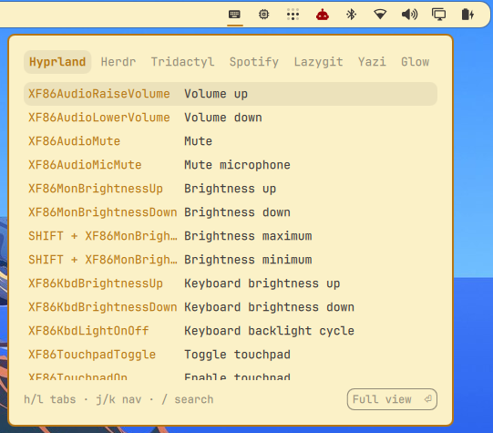
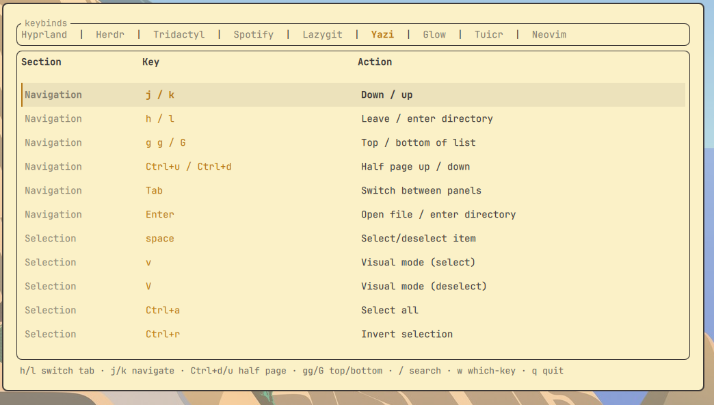

# Omarchy Keybinds

Native Omarchy keybinding reference for the tools you actually use. One tab per
app, opening on the tab matching whatever window was focused, with free-text
search across all of them.

Two surfaces, sharing one service so the binds are read once:

- a **bar widget** — click the icon for a compact keys-and-actions popup you
  can still tab through and search
- a **full overlay** — adds the sections column and the rest of the keys,
  reached from the popup with `Enter`, the **Full view** button, or a
  right-click on the bar icon

A hardcoded list of keybindings is a second copy of a fact the config already
knows, and second copies drift. The tabs that can be read live are read live,
straight from the compositor or a headless dump, never a table someone has to
remember to update.

## Sources

| Tab | Source |
|---|---|
| Hyprland | live — `hyprctl binds -j`, grouped by submap |
| Neovim | live — headless dump of `vim.api.nvim_get_keymap()`, loaded in the background |
| Herdr | bundled defaults + live overrides from `~/.config/herdr/config.toml` |
| Tridactyl | bundled (config lives in browser sync storage, no local file to read) |
| Spotify (spotify_player) | bundled |
| Lazygit | bundled |
| Yazi | bundled (defaults are compiled into the binary) |
| Glow | bundled |
| Tuicr | bundled |

Bundled tables are hand-copied from each tool's documented defaults and live
in `data/*.json`, read by the plugin itself. Nothing outside Hyprland,
Quickshell, and an optional `nvim` is involved.

Reading Hyprland through `hyprctl` rather than parsing `~/.config/hypr/*.conf`
means binds pulled in through any include show up too, along with the submap
each belongs to.

Tabs only appear for tools you actually have: each bundled table names the
binaries it belongs to, and one `which` at startup decides. Hyprland and Neovim
name none and always show.

## Keys

| Key | Action |
|---|---|
| `h` / `l`, `←` / `→`, `Tab` | previous / next tab |
| `j` / `k`, `↑` / `↓` | move selection |
| `Ctrl+d` / `Ctrl+u` | half page down / up (overlay) |
| `gg` / `G` | top / bottom |
| `/` | search the active tab |
| `w` | which-key narrowing: type the chord to filter by it (overlay) |
| `@name` | jump to a tab by name or alias, e.g. `@vim scroll` (overlay) |
| `Enter`, **Full view** button | open the full overlay (popup) |
| `Esc` | leave search or which-key, then close |
| `q` | close |

Both surfaces use the same modal scheme as the terminal build: normal keys
navigate and `/` opens search, so `h`/`j`/`k`/`l` stay reachable.

Search matches multiple words in any order, as substrings or fuzzily, so
"tab next", "next tab", and "nxt tb" all find "Next tab".

## Install

```bash
omarchy plugin add https://github.com/harbefas/omarchy-keybinds
omarchy bar put harbefas.keybinds --section right
omarchy restart shell
```

Install without `--enable` and let `bar put` do the enabling. Passing `--enable`
first registers the plugin on its own, and `bar put` then reports success while
leaving it off the bar. If that already happened, remove the plugin's entry from
`plugins[]` in `~/.config/omarchy/shell.json` and run `bar put` again.

That is all it takes to use it: click the bar icon for the popup, right-click
for the full view.

### A shortcut, if you want one

Nothing is written to your Hyprland config, so there is no keybind unless you
add one, and you may not want one at all since the bar icon works on its own.

Both surfaces answer IPC, so bind whichever key you prefer. On Omarchy Quattro
the bindings live in `~/.config/hypr/bindings.lua`:

```lua
-- the popup, which hands off to the full view with Enter
o.bind("SUPER + SHIFT + H", "Keybinds", "omarchy-shell harbefas.keybinds.widget toggle")

-- or the full view directly
o.bind("SUPER + SHIFT + K", "Keybinds full", "omarchy-shell shell summon harbefas.keybinds")
```

On setups still using `~/.config/hypr/bindings.conf`:

```
bindd = SUPER SHIFT, H, Keybinds, exec, omarchy-shell harbefas.keybinds.widget toggle
```

`SUPER + SHIFT + H` is only a suggestion. The popup mentions it for the first
few opens and stops once any binding references the plugin.

### Without the bar icon

```bash
omarchy plugin enable harbefas.keybinds
omarchy-shell shell summon harbefas.keybinds
```

## Requirements

Hyprland, Quickshell, `timeout`, and `head`, all of which Omarchy already
provides. `nvim` is optional: without it the Neovim tab says so and every other
tab still works.

The Neovim keymaps are dumped in the background on the first open of a shell
session and read straight off a bounded stdout pipe — nothing is written to
disk.

## Terminal version

[keybinds-tui](https://github.com/harbefas/keybinds-tui) is the same idea as a
ratatui TUI, for people not running Omarchy. The two share no code and neither
needs the other installed; the bundled tables started from the same research.

## Remove

```bash
omarchy plugin remove harbefas.keybinds
```

The plugin writes no files at all outside its own directory.

## License

MIT

## Preview

The bar popup, the everyday surface:



The full overlay, one press away:


